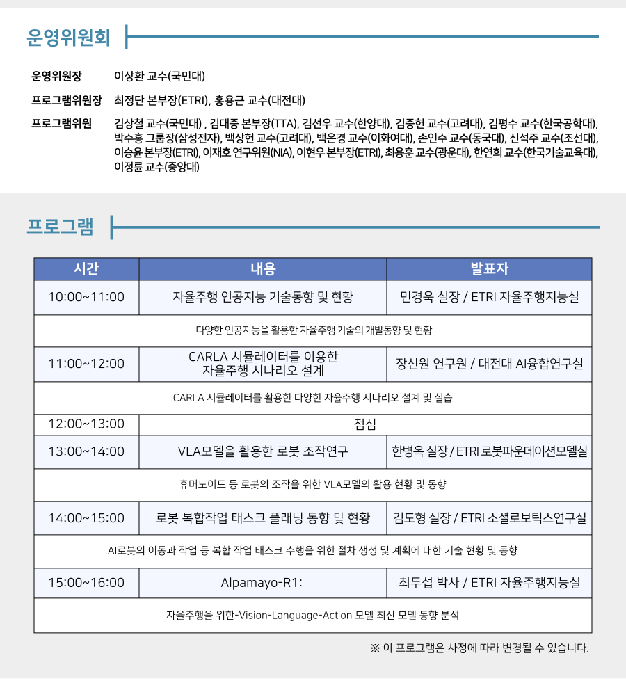

# carla_workshop

2026년 3월 31일 한국컴퓨터통신연구회(OSIA) 발표



# 시작 전 

- 실습은 노트북 파일을 사용합니다. 사용하는 IDE에 맞춰 확장 프로그램을 설치하시거나 주피터랩 혹은 주피터 노트북을 설치해주시면 감사하겠습니다.
- 노트북을 실행하기 위해서 주피터 커널 또한 준비해주셔야 합니다.
```
# 가상환경을 사용할 경우
# $ conda activate carla가상환경이름
$ pip install ipykernel
$ python -m ipykernel install --user --name carla_env --display-name "carla_0.9.14"
```

# CARLA 서버 설치

본 워크숍에서는 0.9.14 버전을 사용합니다.
운영 체제에 맞춰 파일을 다운 받아 주세요.

[CARLA_0.9.14 다운로드](https://github.com/carla-simulator/carla/releases/tag/0.9.14/)

CARLA 0.9.14 서버를 직접 실행하기 위해서는 다음의 사양을 체크해주세요.

- 운영 체제 : 윈도우 10, 11 / 우분투 20.04, 22.04 
- RTX2070 이상의 GPU 혹은 8GB 이상의 VRAM을 가진 GPU
- 20GB 이상의 디스크 공간
- CARLA는 기본적으로 2000번과 2001 포트를 사용하므로, 해당 포트가 방화벽이나 다른 프로그램에 의해 차단되지 않도록 해주세요 .
- Python 3.7
- PIP 20.3 이상

# CARLA 서버 실행
```
# carla 설치 폴더로 이동
$ ./CarlaUE4.sh
# 윈도우의 경우 CarlaUE4.exe 실행
```

# CALRLA 클라이언트 라이브러리 설치
wheel 파일 직접 설치

```
cd /PythonAPI/carla/dist/
pip install carla-0.9.14-cp37-cp37m-manylinux_2_27_x86_64.whl

# libomp5 오류 발생 시
# sudo apt-get install libomp5
```
